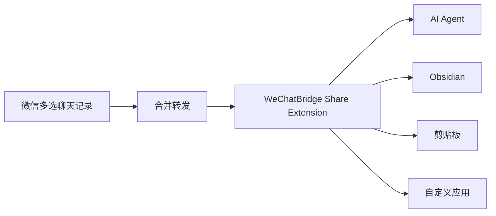

<div align="center">
  
  <h1>WeChatBridge（微信流）</h1>
  <p><strong>从微信转发菜单，把聊天记录送进 AI Agent 与本地知识库。</strong></p>
  <p>原生、轻量、完全本地的 macOS 微信聊天记录转发与归档工具。</p>

  <p>
    <a href="https://github.com/freestylefly/WeChatBridge/actions/workflows/ci.yml"></a>
    <a href="https://github.com/freestylefly/WeChatBridge/releases/latest"></a>
    
    
    <a href="LICENSE"></a>
  </p>

  <p>简体中文 · <a href="README_EN.md">English</a></p>
  <p><a href="https://render.qmuse.pub/p/muse/2413870555736078">官网 · render.qmuse.pub</a></p>
</div>

> [!NOTE]
> 已发布经过 Developer ID 签名和 Apple 公证的 [WeChatBridge 0.1.14 DMG](https://github.com/freestylefly/WeChatBridge/releases/latest)。

## 为什么做微信流

macOS 微信 4.1.13 起，多选聊天记录后可以“合并转发”给第三方应用。微信会生成一份包含 TXT、图片和视频的 ZIP，天然适合交给 AI Agent 处理，也适合沉淀进本地知识库。

系统的“转发到其他应用”列表只展示带有 Share Extension 的 App。微信流补齐这层入口，让一次转发直接抵达 Codex、Claude、豆包、千问办公、WorkBuddy、WeSight、Obsidian、Hermes Agent、剪贴板或你指定的其他应用。



## 核心能力

| 能力 | 使用体验 |
| --- | --- |
| 十个原生入口 | 在微信转发菜单直接选择目标，无需打开微信流主窗口 |
| AI Agent 转发 | 激活目标 App，附加场景指令并自动粘贴聊天归档 |
| Obsidian 沉淀 | 生成 Markdown 笔记，保存原始 ZIP，并按聊天名组织内容 |
| Hermes Agent 投递 | 把归档路径签名后投递给本机 Hermes Webhook，触发一次 Agent 运行 |
| 自定义目标 | 添加任意 macOS 应用，终端类应用可只接收文件路径 |
| 场景与技能 | 为不同群聊保留场景提示词，并管理兼容 Agent 的 `SKILL.md` |
| 本地记录 | 查看批次状态、重新发送、复制、定位文件和清理历史 |
| 失败兜底 | 目标未安装或权限不足时，文件仍会保留在剪贴板 |
| 双语界面 | 完整支持简体中文与 English |

### 内置转发入口

| 入口 | 行为 |
| --- | --- |
| 发给 Codex | 激活 ChatGPT/Codex 并粘贴聊天归档 |
| 发给 Claude | 激活 Claude 并粘贴聊天归档 |
| 发给豆包 | 激活豆包并粘贴聊天归档 |
| 发给千问办公 | 激活千问办公并粘贴聊天归档 |
| 发给 WorkBuddy | 激活 WorkBuddy 并粘贴聊天归档 |
| 发给 WeSight | 激活 WeSight 并粘贴聊天归档 |
| 沉淀到 Obsidian | 创建 Markdown 笔记并保存原始附件 |
| 发给 Hermes | 将批次信息与归档路径签名投递给本机 Hermes Webhook |
| 复制到剪贴板 | 保留文件，交给用户手动粘贴 |
| 发送到自定义 | 转发到用户维护的应用列表 |

## 实际效果

在微信「转发到其他应用」里直接选择目标，不需要先打开微信流主窗口：

<div align="center">
  
</div>

<table>
  <tr>
    <th align="center">入口开关</th>
    <th align="center">场景化</th>
  </tr>
  <tr>
    <td align="center"></td>
    <td align="center"></td>
  </tr>
  <tr>
    <td align="center"><sub>十个入口随时开关，未安装的应用直接标注</sub></td>
    <td align="center"><sub>场景保存提示词与适用 Agent，转发时挑一个</sub></td>
  </tr>
  <tr>
    <th align="center">技能中心</th>
    <th align="center">沉淀到 Obsidian</th>
  </tr>
  <tr>
    <td align="center"></td>
    <td align="center"></td>
  </tr>
  <tr>
    <td align="center"><sub>给 Agent 装上能力包，群里的链接和视频都能读</sub></td>
    <td align="center"><sub>笔记保留原始归档，附件按微信样式渲染</sub></td>
  </tr>
</table>

完整操作步骤、权限说明和常见问题见 [使用指南](USAGE.zh-CN.md)。

## 隐私设计

微信流的处理边界保持清晰：

- 聊天内容只来自微信主动导出的文件。
- 不读取微信数据库，不解密、不注入、不修改微信进程。
- 聊天归档、场景和记录保存在本机。
- Share Extension 在 macOS 沙盒中运行且没有网络权限。
- 屏幕录制权限只用于识别微信标题栏中的聊天名，图像仅在内存中处理。
- 辅助功能权限只用于激活目标应用和执行粘贴。
- 自动更新机制预留给 GitHub Releases，当前源码配置尚未启用自动检查。

更完整的能力边界见 [产品能力文档](PRODUCT_CAPABILITIES.zh-CN.md)。

## 系统要求

- macOS 14 Sonoma 或更高版本
- Xcode 16 或兼容 Swift 6 的 Command Line Tools
- 使用自动粘贴时，需要在系统设置中授予辅助功能权限
- 使用聊天名识别时，需要授予屏幕录制权限

## 下载安装

前往 [GitHub Releases](https://github.com/freestylefly/WeChatBridge/releases/latest) 下载最新 DMG，打开后将“微信流”拖入“应用程序”。安装包同时支持 Apple Silicon 和 Intel Mac。

## 从源码构建

```bash
git clone https://github.com/freestylefly/WeChatBridge.git
cd WeChatBridge
swift test
CONFIG=release Scripts/make-app.sh
```

构建产物位于 `dist/微信流.app`。安装到当前用户的“应用程序”目录并注册分享扩展：

```bash
Scripts/install-dev-build.sh
```

随后打开“微信流 → 设置 → 入口”，启用需要的分享入口。也可以前往“系统设置 → 通用 → 登录项与扩展 → 共享”管理它们。

> [!TIP]
> 本地构建会优先使用钥匙串中的 Apple Development 或 Developer ID 签名。没有可用证书时会使用 ad-hoc 签名，macOS 可能要求重新授予辅助功能权限。

## 项目结构

```text
Sources/
├── WeChatBridgeApp/      # 主应用、设置、转发编排与权限管理
├── WeChatBridgeCore/     # 批次、场景、归档和剪贴板核心逻辑
└── WeChatBridgeShare/    # macOS Share Extension
Resources/                # 图标、Plist、entitlements 与内置技能
Scripts/                  # 构建、安装、签名和发布脚本
Tests/                    # Swift Testing / XCTest 测试
site/                     # Sparkle 更新源与版本说明
```

项目使用 Swift Package Manager 管理源码和 Sparkle 依赖。`Scripts/make-app.sh` 会把主程序与十个 Share Extension 组装成完整的 `.app`。

## 开发与验证

```bash
# 运行测试
swift test

# 校验中英文资源
swift Scripts/check-localizations.swift

# 检查签名、Bundle ID、App Group 与发布配置
Scripts/check-release-config.sh

# 构建、安装并打开开发版本
Scripts/dev-preview.sh
```

## 参与贡献

欢迎提交 Issue 和 Pull Request：

1. 先查看 [Issues](https://github.com/freestylefly/WeChatBridge/issues) 中是否已有相关讨论。
2. Fork 仓库并从 `main` 创建功能分支。
3. 保持改动聚焦，为行为变化补充测试。
4. 提交前运行 `swift test` 和本地化检查。
5. 在 Pull Request 中说明动机、验证方式与界面变化。

涉及安全问题时，请通过 GitHub 的 [Security Advisories](https://github.com/freestylefly/WeChatBridge/security/advisories/new) 私下报告，避免在公开 Issue 中附上敏感细节。

## 路线图

- [x] 微信原生合并转发接入
- [x] Codex、Claude、豆包、千问办公、WorkBuddy 与 WeSight
- [x] Obsidian 本地归档
- [x] 场景提示词与技能管理
- [x] Universal 2 构建、签名与公证流程
- [x] 首个公开 DMG Release
- [ ] Homebrew Cask
- [ ] 更多社区场景和技能包

## 交流群

欢迎加入 WeChatBridge 交流群，与开发者和社区用户交流使用经验、反馈问题与分享工作流。

<div align="center">
  
  <br />
  <sub>使用微信扫码加入交流群</sub>
</div>

## 关于我们

关注项目动态、使用交流与后续更新，可通过微信搜索“数字生命蜗牛”或“苍何”联系我们。

<table>
  <tr>
    <th align="center">数字生命蜗牛</th>
    <th align="center">苍何</th>
  </tr>
  <tr>
    <td align="center"></td>
    <td align="center"></td>
  </tr>
</table>

## 许可证

WeChatBridge 使用 [MIT License](LICENSE) 发布。

## 致谢

- [Dukou（渡口）](https://github.com/qzz0518/Dukou)：微信流基于该项目二次开发。
- [Sparkle](https://github.com/sparkle-project/Sparkle) 提供安全的 macOS 应用更新能力。
- 感谢所有参与测试、提出建议和贡献代码的朋友。

<div align="center">
  <sub>如果微信流对你有帮助，欢迎点亮 ⭐️，让更多需要本地工作流的人看到它。</sub>
</div>
